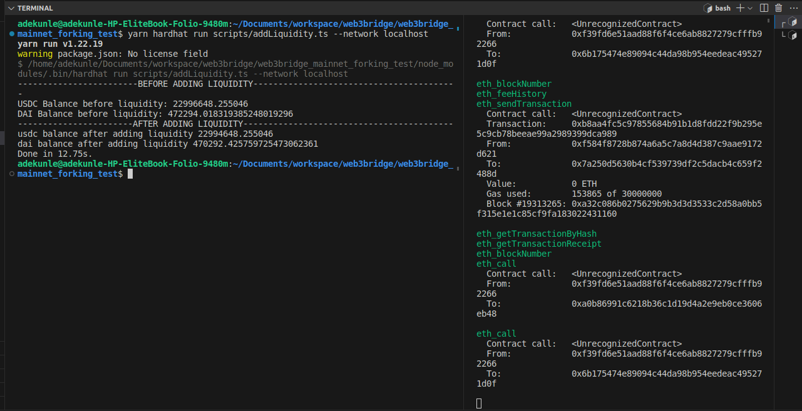

# MAINNET FORKING

Interacted with 2 UNISWAP FUNCTIONS


```shell
function swapTokensForExactTokens(
        uint amountOut,
        uint amountInMax,
        address[] calldata path,
        address to,
        uint deadline
    ) external returns (uint[] memory amounts);

    function addLiquidity(
        address tokenA,
        address tokenB,
        uint amountADesired,
        uint amountBDesired,
        uint amountAMin,
        uint amountBMin,
        address to,
        uint deadline
    ) external returns (uint amountA, uint amountB, uint liquidity);

```

Results of INTERRACTION CAN BE FOUND IN THE *assets* FOLDER




